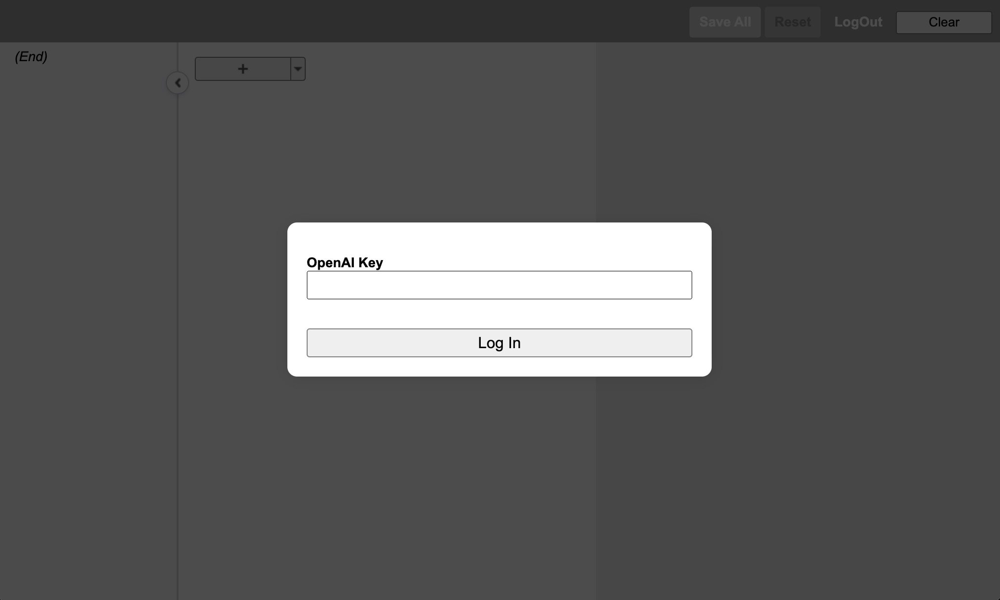
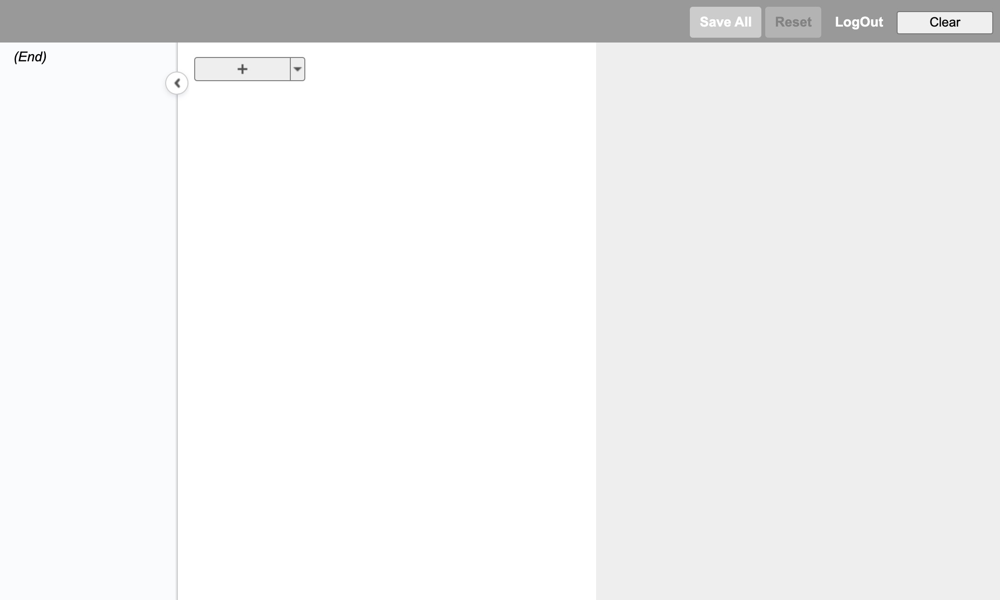
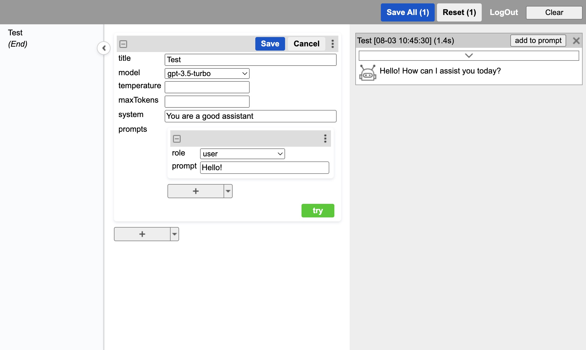

# gpt-playground
A playground for openai chat API request debug. You could try it at [gpt-playground](https://chenbo860826.github.io/gpt-playground/).

*Features including:*

- It works as a debug tool that could compose chat histories. Messages could be easily added, removed, changed through the tool
- It supports parallel requests, multiple API requests could go at the same time, user could add preferred message into history.
- It stores all information in local storage of browser. This makes it easy to use without any backend, but also a limitation because user founds no records when changed browser or device.

## First login

User must provide openAI key to go on when first time login (or after log out).

## After login

After login, gpt-playground shows the operation panel. It could be divided into 4 parts:

1. Top bar: have four operation buttons:
   - `Save All`: Save all editing chat sessions.
   - `Reset`: Reset all editing chat sessions.
   - `Logout`: Remove openAI key and prompt user for a new one (Not necessary to be valid, but it will fail the try operation then).
   - `Clear`: Clear all openAI responses in output zone.
2. Left main zone (contents zone): It shows contents of all chat sessions.
3. Mid main zone (edit zone): It shows all chat sessions
4. Right main zone (output zone): It shows all openAI response messages

User could start using by click the plus (add) button in edit zone to create a new session for edit.

## Usage

There are some tips for usage:

*For Edit*

- The editing sessionn won't be saved until `Save` button or `Save All` button is clicked.
- User could edit an existing object by click its drop down menu and select `edit`, or by double click on its title (gray) bar. User could also save an editing object by double click on its title bar.
- The object could be reordered by drag-and-drop. User could drag an object by press on its title bar.
- User could collapse an object by click the collapse icon on left top of the object. User could collapse all object in the same level by holding shift key down, and then click the collapse icon.

*For API Try*

- User could send request through the `try` button on bottom of an session object. It could be clicked for any times, each click will make a new request to openAI and generate a response in output zone.
- The openAI response message will be shown in output zone. The `add to prompt` button will be enabled after the message completes. It could append the message to its session object.

